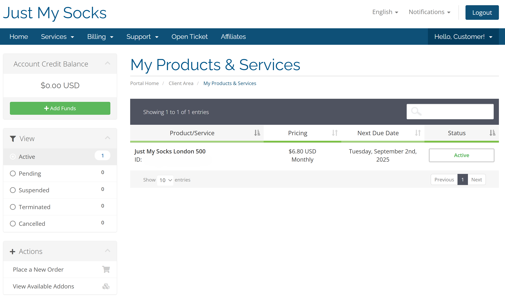
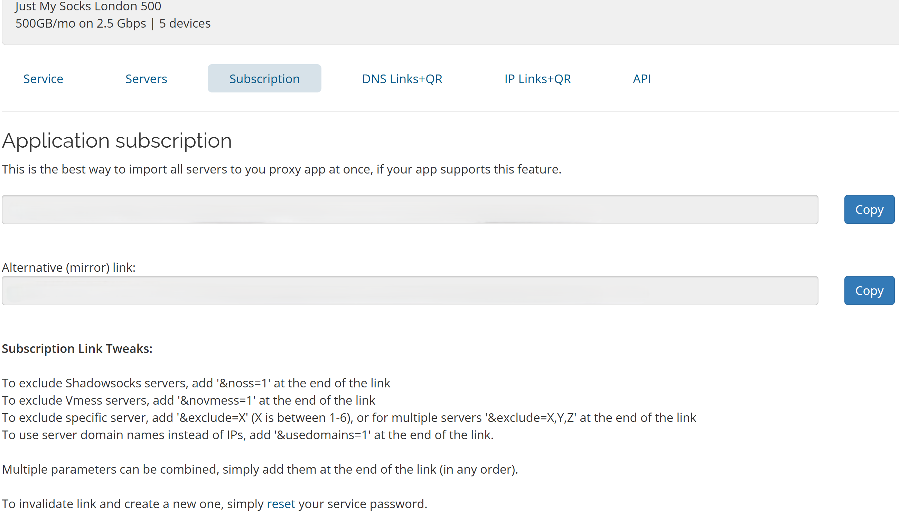
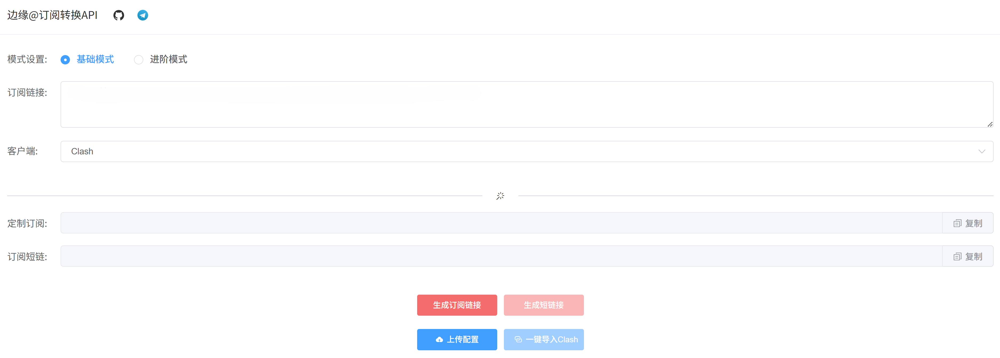
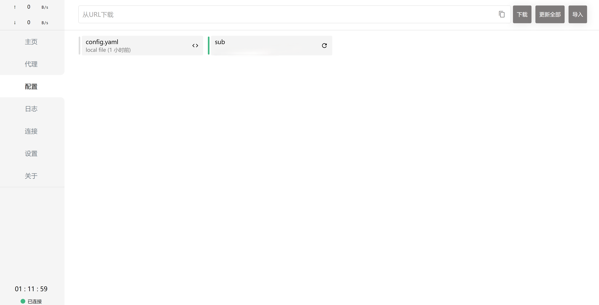
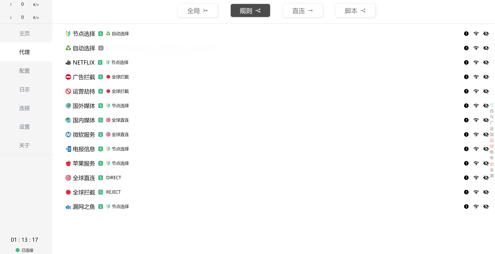
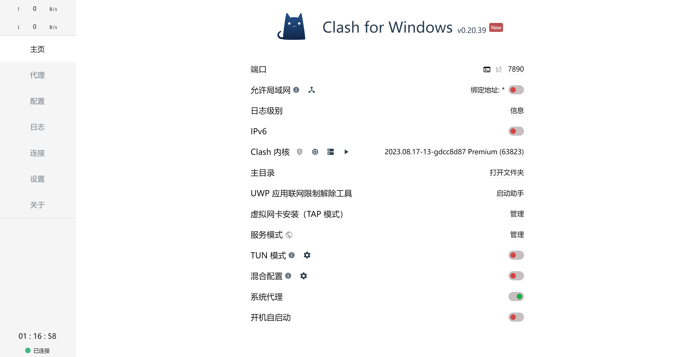

## Clash Client Download
Official Website: https://www.clashforwindows.net/

## Register an account in Just My Socks
Official Website: https://justmysocks.net/members/

Choose a course and subscribe

## Add the subscription to the Clash Client

### Find the subscription link in the dashboard
Click ```Services -> My Services``` in the blue bar to open this page. This page lists all the subscriptions that you have.


Click your active subscription and find the link in the tab "subscription".
\
There should be links in the grey boxes. Click the "Copy" button on the right to copy the link.

### Transfer the link into API
Here I use this website to transfer the link.

https://bianyuan.xyz/


Here I use the Clash Client, so choose the basic mode, and print the link into the subscription link box, then click the "generate subscription link" button (The first red button on the left top).

### Generate the proxy
Paste the generated link into the URL box on the top.


Then you will download the configuration script and the proxy are automatically configured. Then you will find many servers/nodes in the proxy.


Choose the desired node and return to the main page. Finally, tick on the system proxy to activate the VPN. Enjoy the free browse.
