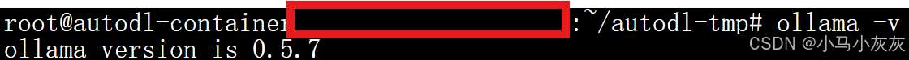
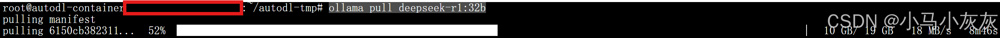
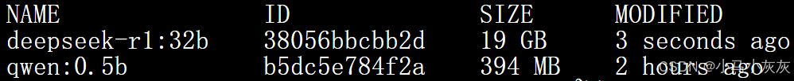
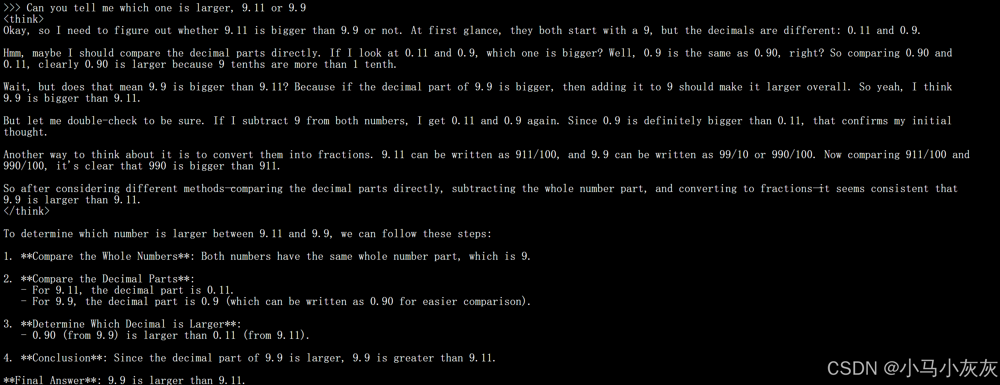

云平台：AutoDL
模型加载工具：Ollama
参考：https://github.com/ollama/ollama/blob/main/docs/linux.md

## 下载Ollama
服务器上下载ollama比较慢，因此我使用浏览器先下载到本地电脑上。

https://ollama.com/download/ollama-linux-amd64.tgz复制到浏览器进行下载
下载好以后，使用FileZilla等工具上传到云服务器上，这里我上传到autodl-tmp文件夹下。
打开一个terminal，解压下载的文件包：
```bash
tar -C /usr -xzf ollama-linux-amd64.tgz
```
## 启用ollama
```bash
ollama serve
```
## 再打开一个terminal，检查一下ollama是否启用
```bash
ollama -v
```
这里可以看到ollama版本，说明启用成功。

## 拉取模型
这里以deepseek-r1:32b为例进行拉取
```bash
ollama pull deepseek-r1:32b
```

<font color='red'>下载过程中可能有掉速，Ctrl+C掉以后再重新ollama pull可以继续下载。</font>
下载完成以后可以查看一下模型列表：
```bash
ollama list
```


运行模型：
```bash
ollama run deepseek-r1:32b
```
测试了一个很常见的，却有许多模型答错的问题：9.11和9.9比大小

这个模型的链式推理很有人味儿，很有吸引力，这可能就是这个模型受很多人关注和称赞的原因吧